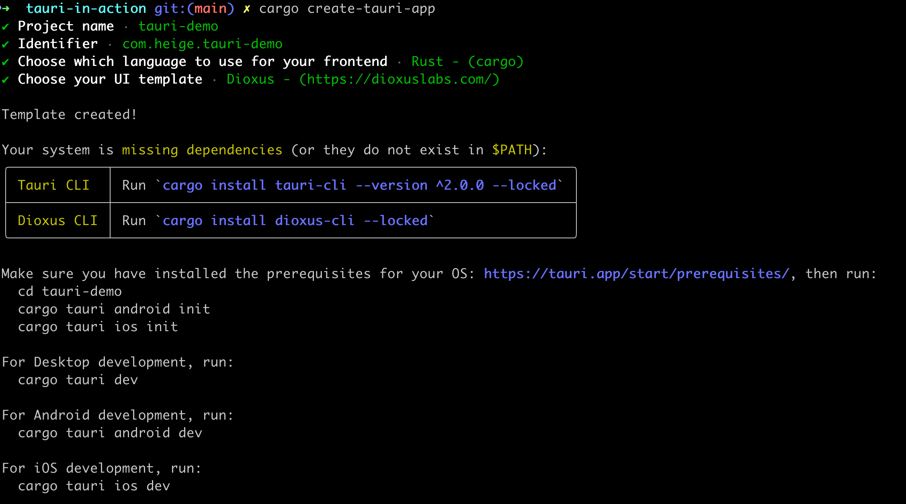
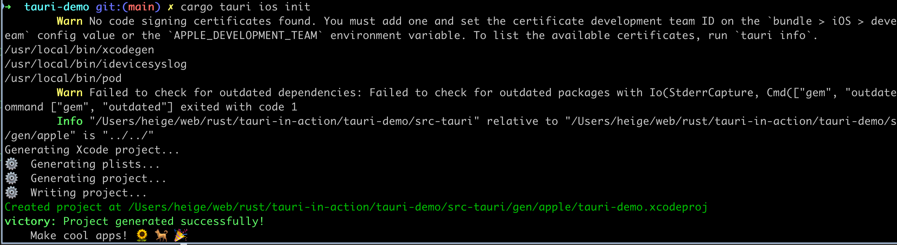
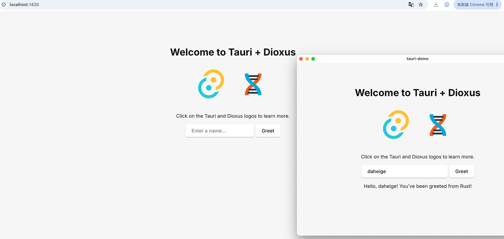

# tauri-in-action

tauri in action notes

# about tauri

Tauri 是一个用于构建小巧、快速的二进制程序的框架，支持所有主流桌面和移动平台。开发者可以集成任何能编译为 HTML、JavaScript 和
CSS 的前端框架来构建用户界面，并在需要时利用 Rust、Swift 和 Kotlin 等语言处理后端逻辑。

官方文档：

- https://tauri.app/zh-cn/start/
- https://crates.io/crates/tauri

## why Tauri？

Tauri 为开发者提供了三大主要优势，可用于构建应用程序：

- 为构建应用提供安全的基础
- 利用系统原生 WebView，实现更小的打包体积
- 灵活性强，开发者可使用任意前端框架，并支持多种语言的绑定

# tauri tools install

使用 tauri cli 前置要求：https://tauri.app/zh-cn/start/prerequisites/ 需要先根据不同操作系统，安装对应的工具链，例如：rust
安装。

下面我以 macos 系统为例，安装 tauri 相关工具链。

```shell
rustup target add aarch64-apple-ios x86_64-apple-ios aarch64-apple-ios-sim
brew install cocoapods
cargo install create-tauri-app --locked
cargo create-tauri-app
```

执行第二个命令后，就会创建一个tauri项目，运行效果如下：

```ini
✔ Project name · tauri-demo
✔ Identifier · com.heige.tauri-demo
✔ Choose which language to use for your frontend · Rust - (cargo)
✔ Choose your UI template · Dioxus - (https://dioxuslabs.com/)

Template created!

Your system is missing dependencies (or they do not exist in $PATH):
╭────────────┬─────────────────────────────────────────────────────────╮
│ Tauri CLI  │ Run `cargo install tauri-cli --version ^2.0.0 --locked` │
├────────────┼─────────────────────────────────────────────────────────┤
│ Dioxus CLI │ Run `cargo install dioxus-cli --locked`                 │
╰────────────┴─────────────────────────────────────────────────────────╯

Make sure you have installed the prerequisites for your OS: https://tauri.app/start/prerequisites/, then run:
  cd tauri-demo
  cargo tauri android init
  cargo tauri ios init

For Desktop development, run:
  cargo tauri dev

For Android development, run:
  cargo tauri android dev

For iOS development, run:
  cargo tauri ios dev
```



上面的提示说明，dioxus工具链需要安装 (这里ui风格，我选择了dioxus，因此需要安装dioxus相关工具链)

```shell
rustup target add wasm32-unknown-unknown
cargo install dioxus-cli --locked
```

`cargo tauri ios init` 这个命令 必须在项目根目录（包含 src-tauri/ 文件夹的那一层）运行。此时，需要进入项目中，执行这些命令：

```shell
cd tauri-demo
cargo tauri android init

# 这个命令会根据操作系统，初始化 target aarch64-apple-ios，对于 macos 系统需要先安装 cocoapods
brew install cocoapods
# 验证 cocoapods，如果输出对应的版本，表示安装成功，例如：1.17.0
which pod
pod --version
cargo tauri ios init

# 根据平台选择初始化命令
#For Desktop development, run:
cargo tauri dev

#For Android development, run:
cargo tauri android dev

#For iOS development, run:
cargo tauri ios dev
```

我使用 macos 系统初始化，效果如下：


执行 `cargo tauri dev` 运行后，就会启动一个 desktop 运行窗口（浏览器也可以访问），效果如下：


运行的效果，输出来自 src-tauri/src/lib.rs ，这里的 src-tauri/src/main.rs 只负责应用运行，比较薄的一层。实际上它运行会先执行
build.rs 初始化

```shell
fn main() {
    tauri_build::build()
}
```

如果想运行 `cargo tauri ios dev` 命令，先需要停止 `cargo tauri dev`，因为它们在本地开发，公用了一个端口
1420，运行的地址是 http://localhost:1420

# tauri project layout

项目结构说明：https://tauri.app/zh-cn/start/project-structure/

```ini
tree -L 2 ./
./
├── assets
│ ├── dioxus.png
│ ├── styles.css
│ └── tauri.svg
├── Cargo.lock
├── Cargo.toml
├── Dioxus.toml
├── README.md
├── src
│ ├── app.rs
│ └── main.rs
├── src-tauri
│ ├── build.rs
│ ├── capabilities
│ ├── Cargo.toml
│ ├── gen
│ ├── icons
│ ├── src
│ └── tauri.conf.json
└── target
    ├── aarch64-apple-ios
    ├── CACHEDIR.TAG
    ├── debug
    ├── dx
    ├── wasm-dev
    └── wasm32-unknown-unknown

14 directories, 13 files
```

在这种情况下，JavaScript 项目位于顶层目录，而 Rust 项目则位于 src-tauri/ 文件夹内。 这个 Rust 项目是一个标准的 Cargo
项目但包含了一些额外的文件：

- tauri.conf.json 是 Tauri 的主要配置文件，其中包含了从应用标识符到开发服务器 URL 的所有配置。 该文件也是 Tauri CLI 查找
  Rust 项目的标记文件。 如需了解更多信息，请参阅 Tauri 配置。
- capabilities/ 目录是 Tauri 默认读取能力（Capability）文件的文件夹（简而言之，你需要在此处允许命令，才能在 JavaScript
  代码中使用它们）。 如需了解更多信息，请参阅安全。
- icons/ 目录是 tauri icon 命令的默认输出目录，通常在 tauri.conf.json > bundle > icon 中引用，用于设置应用的图标。
- src-tauri/build.rs 包含 tauri_build::build()，用于 Tauri 的构建系统。
- src-tauri/lib.rs 包含 Rust 代码和移动端入口点（标记为 #[cfg_attr(mobile, tauri::mobile_entry_point)] 的函数）。
  我们不直接在src-tauri/main.rs 中编写代码的原因是，在移动端构建中，你的应用会被编译为库，并通过平台框架加载。
- src-tauri/src/main.rs 是桌面端的主入口点，我们在 main 函数中调用 tauri_demo_lib::run()
  ，以使用与移动端相同的入口点。因此，为了简化操作，请勿修改此文件，而是修改
  lib.rs。请注意，app_lib 对应 Cargo.toml 中的 [lib.name]。

Tauri 的工作方式类似于静态网站托管服务。其构建过程是：首先将 JavaScript 项目编译为静态文件， 然后编译 Rust
项目并将这些静态文件打包进去。因此，JavaScript 项目的设置与构建静态网站时基本相同。

如果你只想使用 Rust 代码，只需移除其他所有内容，并将 src-tauri/ 文件夹作为你的顶级项目，或作为 Rust 工作区的成员即可。

# create-tauri-app

Tauri 之所以如此灵活，原因之一在于它几乎可以与任何前端框架协同工作。 我们可以通过 create-tauri-app
工具创建项目，同时它帮助你使用官方维护的框架模板创建一个新的 Tauri 项目。

create-tauri-app 目前包含以下模板：原生（即不使用框架的HTML、CSS 和
JavaScript）、Vue.js、Svelte、React、SolidJS、Angular、Preact、Yew、Leptos 和 Sycamore。你还可以在 Awesome Tauri
仓库中查找或添加由社区提供的其他模板和框架。

或者，你也可以 将 Tauri 添加到现有的项目中 快速将你现有的代码库转换为 Tauri 应用。
