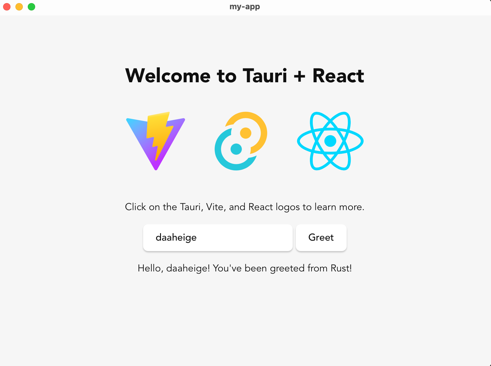

# Tauri + React

This template should help get you started developing with Tauri and React in Vite.

前置操作

1. 访问 https://nodejs.org/zh-cn/download 下载nodejs，并安装好 nodejs
2. 设置 npm 镜像加速

```shell
npm config set registry https://registry.npmmirror.com
npm install -g pnpm
pnpm config set registry https://registry.npmmirror.com
```

3. 通过 `cargo create-tauri-app`命令，选择前端 pnpm + js+ react 框架生成项目。可根据实际情况选择前端框架，支持vue/react等不同框架。

```shell
cargo create-tauri-app
```

运行结果如下：

```ini

✔ Project name · my-app
✔ Identifier · com.heige.my-app
✔ Choose which language to use for your frontend · TypeScript / JavaScript - (pnpm, yarn, npm, deno, bun)
✔ Choose your package manager · pnpm
✔ Choose your UI template · React - (https://react.dev/)
✔ Choose your UI flavor · JavaScript

Template created! To get started run:
  cd my-app
  pnpm install
  pnpm tauri android init
  pnpm tauri ios init

For Desktop development, run:
  pnpm tauri dev

For Android development, run:
  pnpm tauri android dev

For iOS development, run:
  pnpm tauri ios dev
```

接下来就可以，进入项目中初始化

```shell
cd my-app
pnpm install
pnpm tauri android init
pnpm tauri ios init

#For Desktop development, run:
pnpm tauri dev

#For Android development, run:
pnpm tauri android dev

#For iOS development, run:
pnpm tauri ios dev
```

此时 src 目录中，就是前端 react 框架相关的代码。

执行 `pnpm tauri ios init` 初始化后，就可以通过 `pnpm tauri dev` 启动桌面应用，这个过程就会做前端项目编译构建。

运行效果如下：


## Recommended IDE Setup

- [VS Code](https://code.visualstudio.com/) + [Tauri](https://marketplace.visualstudio.com/items?itemName=tauri-apps.tauri-vscode) + [rust-analyzer](https://marketplace.visualstudio.com/items?itemName=rust-lang.rust-analyzer)

## react

https://zh-hans.react.dev/learn

